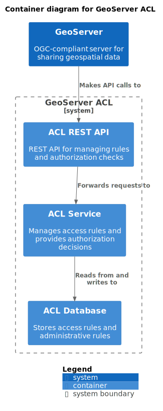

# Architecture

This page provides a comprehensive overview of the GeoServer ACL architecture, designed to help developers understand the system's structure, components, and design principles.

## Architectural Overview

GeoServer ACL follows a modern, modular architecture with a clear separation of concerns. It's built using Domain-Driven Design (DDD) principles and a hexagonal architecture pattern.

### High-Level Architecture


The system consists of the following major components:

1. **Domain Layer**: Core business logic, entities, and rules
2. **Application Layer**: Use cases and orchestration
3. **Infrastructure Layer**: Technical implementations and external integrations
4. **API Layer**: REST API for integration and management
5. **GeoServer Plugin**: Integration with GeoServer

## Domain Model

The domain model is the heart of GeoServer ACL and encapsulates the core business concepts.

### Key Domain Objects

#### Rule

Rules define access control policies for GeoServer resources:

```java
public class Rule {
    private RuleIdentifier id;
    private Long priority;
    private GrantType access;
    private String username;
    private String rolename;
    private String instanceName;
    private String service;
    private String request;
    private String subfield;
    private String workspace;
    private String layer;
    private RuleLimits ruleLimits;
    private LayerDetails layerDetails;
    // ...
}
```

#### AdminRule

AdminRules define administrative access policies:

```java
public class AdminRule {
    private AdminRuleIdentifier id;
    private Long priority;
    private String username;
    private String rolename;
    private String instanceName;
    private String workspace;
    private AdminGrantType access;
    // ...
}
```

#### Access Control Objects

- **AccessRequest**: Represents a request for access to a GeoServer resource
- **AccessInfo**: Contains the result of an authorization evaluation
- **LayerDetails**: Detailed access configuration for a specific layer
- **RuleLimits**: Constraints on access, such as spatial limitations

### Domain Services

Domain services implement the core business logic:

- **RuleAdminService**: Manages data access rules
- **AdminRuleAdminService**: Manages administrative rules
- **AuthorizationService**: Evaluates access requests against rules

### Repository Interfaces

The domain layer defines repository interfaces that abstract persistence operations:

- **RuleRepository**: Operations for storing and retrieving rules
- **AdminRuleRepository**: Operations for storing and retrieving admin rules

## Hexagonal Architecture

GeoServer ACL follows a hexagonal (ports and adapters) architecture pattern:



### Ports

The domain defines ports (interfaces) for external interactions:

- **Repository interfaces**: For data persistence
- **Service interfaces**: For business logic
- **Event interfaces**: For system events

### Adapters

Adapters implement the ports and handle communication with external systems:

- **REST API adapters**: Implement service interfaces for HTTP clients
- **JPA adapters**: Implement repository interfaces using JPA
- **GeoServer plugin adapter**: Integrates with GeoServer

## Technical Architecture

### Package Structure

GeoServer ACL is organized into a hierarchical package structure:

```
org.geoserver.acl
├── domain                  # Domain model and interfaces
│   ├── rules               # Rule domain objects and services
│   ├── adminrules          # Admin rule domain objects and services
│   ├── filter              # Rule filtering and querying
│   └── authorization       # Authorization logic
├── integration             # Infrastructure implementations
│   ├── persistence-jpa     # JPA-based repositories
│   ├── spring              # Spring framework integration
│   └── openapi             # OpenAPI implementation
├── application             # Application services
│   ├── authorization-api   # Authorization API
│   └── authorization-impl  # Authorization implementation
├── plugin                  # GeoServer plugin
│   ├── accessmanager       # GeoServer integration
│   ├── config              # Plugin configuration
│   └── web                 # Web UI
└── artifacts               # Deployment artifacts
    ├── api                 # Standalone service
    └── testcontainer       # Testing containers
```

### Module Structure

The system is divided into multiple Maven modules:

1. **Domain Modules**:
   - `domain/rule-management`: Rule domain model
   - `domain/adminrule-management`: Admin rule domain model
   - `domain/filter`: Common filtering components

2. **Application Modules**:
   - `application/authorization-api`: Authorization API interfaces
   - `application/authorization-impl`: Authorization implementation

3. **Integration Modules**:
   - `integration/persistence-jpa`: JPA persistence
   - `integration/spring-boot`: Spring Boot integration
   - `integration/openapi`: OpenAPI implementation

4. **Plugin Modules**:
   - `plugin/accessmanager`: GeoServer integration
   - `plugin/web`: Web UI
   - `plugin/plugin`: Assembled plugin

5. **Artifact Modules**:
   - `artifacts/api`: Standalone service
   - `artifacts/testcontainer`: Test containers

## Key Components

### Authorization Service

The authorization service determines if a user can access a specific resource:

```java
public interface AuthorizationService {
    /**
     * Authorizes a request to access a resource.
     */
    AccessInfo getAccessInfo(AccessRequest request);

    /**
     * Gets a summary of accessible workspaces and layers.
     */
    AccessSummary getAccessSummary(AccessSummaryRequest request);

    /**
     * Authorizes an administrative request.
     */
    AdminAccessInfo getAdminAuthorization(AdminAccessRequest request);
}
```

### Rule Administration

The rule administration service manages access rules:

```java
public interface RuleAdminService {
    /**
     * Gets a rule by ID.
     */
    Optional<Rule> get(String id);

    /**
     * Creates a new rule.
     */
    Rule insert(Rule rule);

    /**
     * Updates an existing rule.
     */
    Rule update(Rule rule);

    /**
     * Deletes a rule.
     */
    boolean delete(String id);

    /**
     * Finds rules matching a filter.
     */
    Stream<Rule> getAll(RuleFilter filter);
}
```

### Admin Rule Administration

The admin rule administration service manages administrative rules:

```java
public interface AdminRuleAdminService {
    /**
     * Gets an admin rule by ID.
     */
    Optional<AdminRule> get(String id);

    /**
     * Creates a new admin rule.
     */
    AdminRule insert(AdminRule rule);

    /**
     * Updates an existing admin rule.
     */
    AdminRule update(AdminRule rule);

    /**
     * Deletes an admin rule.
     */
    boolean delete(String id);

    /**
     * Finds admin rules matching a filter.
     */
    Stream<AdminRule> getAll(AdminRuleFilter filter);
}
```

### REST API

The REST API exposes GeoServer ACL functionality through HTTP endpoints:

- `/api/rules`: Rule management
- `/api/adminrules`: Admin rule management
- `/api/authorization`: Authorization operations

The API is defined using OpenAPI/Swagger and includes automatically generated documentation.

### GeoServer Integration

GeoServer ACL integrates with GeoServer through the ResourceAccessManager interface:

```java
public class ACLResourceAccessManager implements ResourceAccessManager {
    @Override
    public AccessLimits getAccessLimits(Authentication user, ResourceInfo resource) {
        // Convert to AccessRequest
        // Call AuthorizationService
        // Convert AccessInfo to AccessLimits
    }
    
    // Other ResourceAccessManager methods
}
```

## Data Flow

### Authorization Flow

1. GeoServer receives a service request (WMS, WFS, etc.)
2. The ACL plugin creates an AccessRequest
3. The AccessRequest is sent to the AuthorizationService
4. The AuthorizationService finds matching rules
5. The highest priority rule determines access
6. The AccessInfo result is converted to GeoServer AccessLimits
7. GeoServer applies the limits to the service response


### Rule Management Flow

1. User or system sends a rule management request
2. The REST API validates the request
3. The RuleAdminService processes the operation
4. The RuleRepository persists the changes
5. If configured, events are published to notify other components

## Persistence Architecture

GeoServer ACL uses JPA with Hibernate for data persistence:

- **Entities**: JPA entities represent database tables
- **Repositories**: Spring Data JPA repositories provide data access
- **Mappers**: Mappers convert between domain objects and entities

### Database Schema

The core database schema includes:

- **Rules Table**: Stores access rules
- **Admin Rules Table**: Stores administrative rules
- **Layer Details Table**: Stores layer-specific access details
- **Rule Limits Table**: Stores spatial and other limitations

## Caching Architecture

GeoServer ACL implements a multi-level caching strategy:

1. **First Level**: In-memory cache of authorization results
2. **Second Level**: Rule evaluation results
3. **Third Level**: Database query results

Cache consistency is maintained through:
- Time-based expiration
- Event-based invalidation on rule changes
- Manual cache clearing

## Event System

The event system allows for loose coupling and distributed operations:

- **Rule Events**: Triggered when rules change
- **Admin Rule Events**: Triggered when admin rules change
- **Cache Invalidation Events**: Triggered to clear caches

Events can be distributed using Spring Cloud Bus for multi-node deployments.

## Extension Points

GeoServer ACL provides several extension points:

### Custom Rule Types

You can extend the rule system with custom rule types:

1. Create a custom rule class extending Rule
2. Implement custom evaluation logic
3. Register the custom rule type with the rule service

### Authentication Integration

The authentication system can be integrated with various providers:

- LDAP/Active Directory
- OAuth2/OpenID Connect
- Custom authentication systems

### Storage Backend

While PostgreSQL is the primary storage, the repository interfaces allow for custom implementations:

1. Implement the repository interfaces
2. Configure GeoServer ACL to use your implementation

## Development Approach

GeoServer ACL follows these development principles:

### Domain-Driven Design

- The domain model drives the design
- Ubiquitous language throughout the codebase
- Clear separation of domain, application, and infrastructure

### Test-Driven Development

- Comprehensive unit tests for all components
- Integration tests for key workflows
- Test containers for database testing

### Continuous Integration

- Automated builds and tests
- Code quality checks
- Dependency vulnerability scanning

## Technology Stack

- **Java**: Core language (Java 11+, Java 17 recommended)
- **Spring Boot**: Application framework
- **Spring Data JPA**: Data access
- **Hibernate**: ORM implementation
- **PostgreSQL**: Database
- **PostGIS**: Spatial database extension
- **OpenAPI**: API specification
- **Maven**: Build system
- **Docker**: Containerization