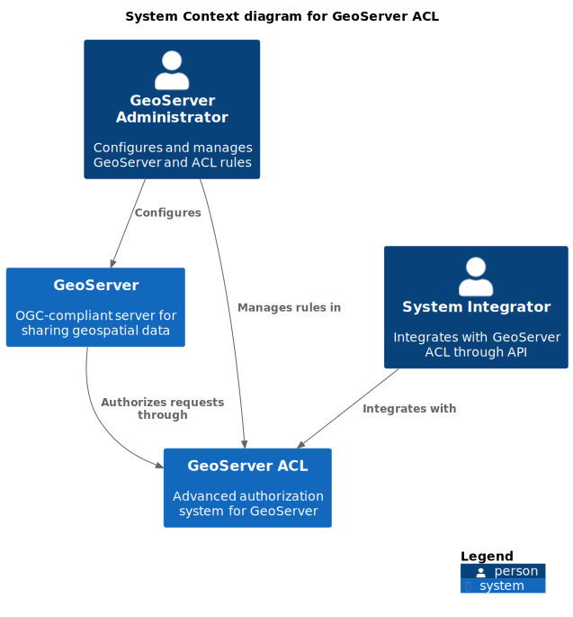

# System Scope and Context

## Business Context

GeoServer ACL operates within the broader context of geospatial data management and access control. This section describes the business context in which GeoServer ACL operates and its relationships with external systems and users.

### Users and External Systems

| Actor/System | Description | Responsibility | Interface |
|--------------|-------------|----------------|-----------|
| GeoServer Users | End users who access geospatial data through GIS clients | Consume geospatial services while subject to access control rules | OGC services (WMS, WFS, WCS, etc.) |
| GeoServer Administrators | Users who manage GeoServer and configure access control rules | Define and maintain access control policies | GeoServer Admin UI, ACL REST API |
| System Integrators | Developers who integrate ACL with other systems | Automate rule management and extend functionality | ACL REST API |
| GIS Clients | Desktop or web applications that access GeoServer services | Request geospatial data from GeoServer on behalf of users | OGC services, HTTP/HTTPS |
| Authentication Provider | External systems that authenticate users | Verify user identity and provide authentication information | Various (LDAP, OAuth2, OpenID Connect, etc.) |
| GeoServer | OGC-compliant server for sharing geospatial data | Serve spatial data while enforcing access control through the ACL plugin | ACL Plugin interface |

## Technical Context

GeoServer ACL consists of two main components that interact with different technical systems:

1. **GeoServer ACL Service**: A standalone application that manages rules and evaluates authorization requests
2. **GeoServer ACL Plugin**: A plugin that integrates with GeoServer to enforce access control

### GeoServer ACL Service Technical Context

| Interface | Description | Technology |
|-----------|-------------|------------|
| REST API | Interface for managing rules and performing authorization checks | HTTP/HTTPS, JSON, OpenAPI 3.0 |
| Database Connection | Persistence of rules and configuration | JDBC, JPA |
| Event Bus | Optional event publishing for rule changes | Spring Cloud Bus, RabbitMQ |

### GeoServer ACL Plugin Technical Context

| Interface | Description | Technology |
|-----------|-------------|------------|
| ResourceAccessManager | GeoServer extension point for security integration | Java Interface |
| ACL Service Client | Client connection to the ACL Service | HTTP/HTTPS, REST |
| GeoServer Admin UI Integration | UI for managing rules within GeoServer | Java, HTML/CSS/JS |

## Domain Model Context

GeoServer ACL operates within the domain of geospatial access control, which involves several key domain concepts:

1. **Data Access Rules**: Define who can access which resources under what conditions
2. **Administrative Rules**: Define who can administer which workspaces
3. **Access Requests**: Represent a request to access GeoServer resources
4. **Access Decisions**: Represent the result of evaluating access rules for a request

### Key Domain Concepts

| Concept | Description | Relationships |
|---------|-------------|---------------|
| Rule | A policy that grants or restricts access to resources | Associated with users, roles, workspaces, layers |
| AdminRule | A policy that grants administrative privileges | Associated with users, roles, workspaces |
| Workspace | A GeoServer container for organizing data | Contains layers, associated with rules |
| Layer | A published geospatial dataset | Belongs to a workspace, associated with rules |
| User | An authenticated entity accessing resources | Subject to rules, may have roles |
| Role | A group of permissions assigned to users | Associated with users, referenced by rules |
| Access Request | A request to access GeoServer resources | Contains user, role, service, request type, workspace, layer |
| Access Info | The result of evaluating rules for a request | Contains access decision, filters, limits |

## System Scope

GeoServer ACL provides the following capabilities within its scope:

1. **Rule Management**: Creation, update, deletion, and querying of data access rules
2. **Admin Rule Management**: Creation, update, deletion, and querying of administrative access rules
3. **Authorization**: Evaluation of access requests against defined rules
4. **Integration**: Connection to GeoServer through the plugin mechanism
5. **UI Integration**: Extension of GeoServer Admin UI for rule management

### Out of Scope

The following areas are explicitly outside the scope of GeoServer ACL:

1. **Authentication**: GeoServer ACL does not handle user authentication; it relies on GeoServer's authentication mechanisms
2. **Data Management**: GeoServer ACL does not manage geospatial data; it only controls access to it
3. **Service Implementation**: GeoServer ACL does not implement OGC services; it only controls access to GeoServer's services
4. **User/Role Management**: GeoServer ACL does not manage users or roles; it only references them in rules