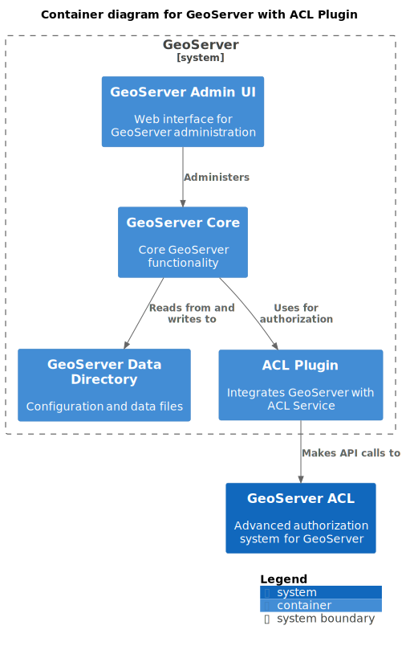

# Building Block View

This section describes the main building blocks of GeoServer ACL and their interactions.

## Level 1: System Context

The System Context view shows GeoServer ACL in the context of its users and surrounding systems.

### Key Elements

1. **GeoServer Users**: End users accessing GeoServer resources through OWS services
2. **GeoServer Administrators**: Configure and manage GeoServer and ACL rules
3. **System Integrators**: Developers integrating with GeoServer ACL through its API
4. **GIS Clients**: Desktop or web applications that access GeoServer services
5. **Authentication Provider**: External authentication system (e.g., OAuth2, LDAP)
6. **GeoServer**: The OGC-compliant server for sharing geospatial data
7. **GeoServer ACL**: The authorization system that controls access to GeoServer resources

## Level 2: Container View

The Container view breaks down both GeoServer ACL and GeoServer into their main containers.

### GeoServer ACL Containers

#### Key Containers

1. **ACL Service**: Core business logic that manages access rules and provides authorization decisions
2. **ACL Database**: Persistent store for access rules and administrative rules
3. **ACL REST API**: REST interface for managing rules and performing authorization checks

### GeoServer Containers

#### Key Containers

1. **GeoServer Core**: Core GeoServer functionality
2. **GeoServer Data Directory**: Configuration and data files
3. **GeoServer Admin UI**: Web interface for GeoServer administration
4. **ACL Plugin**: Integrates GeoServer with the ACL Service

## Level 3: Component View

At the component level, GeoServer ACL consists of the following main components:

### ACL Service Components

The ACL Service contains these key components:

1. **Domain Model**: Core entities and value objects including:
   - Rule: Represents a data access rule with priority and filtering criteria
   - AdminRule: Represents an administrative access rule
   - RuleFilter/AdminRuleFilter: Used to query rules based on criteria

2. **Rule Management**: Manages data access rules with operations such as:
   - Creating, updating, and deleting rules
   - Finding rules matching specific criteria
   - Handling rule priorities and conflicts

3. **Admin Rule Management**: Manages administrative access rules with operations such as:
   - Creating, updating, and deleting admin rules
   - Finding admin rules matching specific criteria
   - Handling admin rule priorities and conflicts

4. **Authorization Service**: Evaluates access requests against rules:
   - Finds matching rules for a request
   - Determines the effective access decision
   - Applies spatial and attribute filtering

5. **Persistence Layer**: Database access and object mapping:
   - Stores and retrieves rules and admin rules
   - Maps between domain objects and database entities
   - Handles transactions and concurrency

6. **API Implementation**: Implements the REST API endpoints:
   - Exposes rule management operations
   - Exposes admin rule management operations
   - Provides authorization endpoints

### ACL Plugin Components

The GeoServer ACL Plugin contains these key components:

1. **ACL Resource Access Manager**: Implements GeoServer's ResourceAccessManager interface:
   - Intercepts GeoServer resource access requests
   - Translates GeoServer security concepts to ACL concepts
   - Applies access decisions to GeoServer resources

2. **Access Request Builder**: Converts GeoServer requests to ACL requests:
   - Extracts user, role, and resource information from GeoServer requests
   - Builds AccessRequest objects for the ACL Service
   - Handles different request types (WMS, WFS, etc.)

3. **Web UI Extension**: Extends GeoServer Admin UI with ACL management:
   - Provides UI for managing rules and admin rules
   - Allows testing and verification of rules
   - Shows access summaries and diagnostics

4. **ACL Client Adaptor**: Client for the ACL Service REST API:
   - Communicates with the ACL Service
   - Handles authentication and error scenarios
   - Provides caching for performance optimization